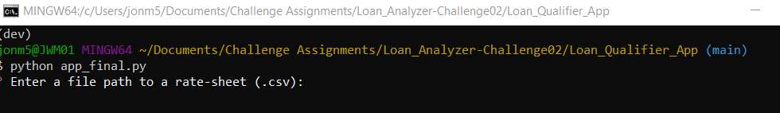
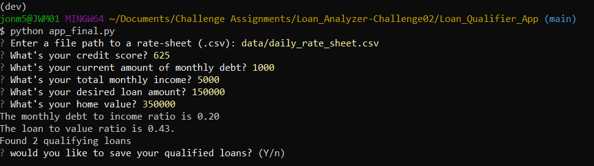
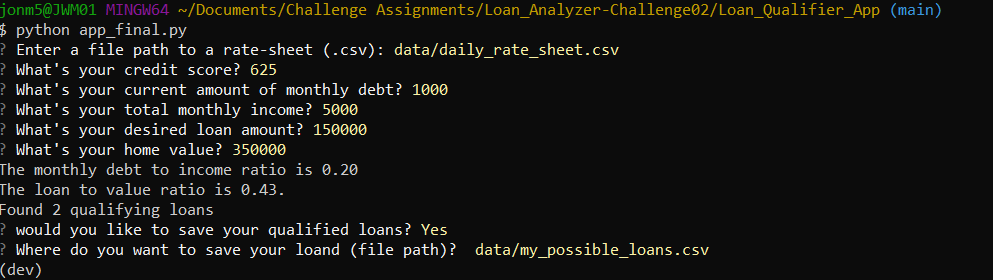
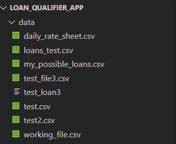

# Loan_Qualifier_App

UW FinTech Challenge Assignment 02
for this assigment we have been tasked with enhancing a loan qualifcation app so that user can export their available loans (based on key criteria they enter) to a csv file for future reference.

---

## Technologies

The program has been written in Python, and created using visual studio for coding purposes and git bash for testing.  We are running the program in the conda dev environment. Libraries used include:

    - sys
    - fire
    - questionary
    - csv
    - pathlib (Path)

---

## Installation Guide

### Start the Program

In the above image you will see that the program is launched in git bash for windows.
    First navigate to the Loan Qualifier App folder
    Type python app_final.py
    Proceed to enter the user requested information (detailed instructions below)

---

## Usage

### User Enters Their Data

First, select the file that has all of the available loans for that day.  
    This is located in the data folder and is called daily_rate_sheet.csv

Next, enter the required information including
    - Credit score
    - Monthly debt
    - Monthly income
    - Ammount you wish to borrow
    - Value of the asset used for collateral (in this case your home)

With this infomration, the system will calculate key metrics inclduing debt to income and loan to asset value
This will determine which banks would consider your loan application
If no loans are available the program will let you know and end
If loans are available it will tell you how many and ask if you want to save them as a new csv file

### Saving Your Available Loans

Once you decide to save a list of available loans you must assign a path and file name.
We recommend saving this file in the data folder within Loan Qualifier app as seen below:

Note:  It is very important to save your file as a .csv, otherwise it will be saved as a .txt file

---

## Contributors

This program has been developed by Jon Mitchel as part of the learning for the University of Washington FinTech Bootcamp 2022.

Special thanks to the following:
    Gerrit Hall - instructor
    Kyle Gee & Aarti Couture - teaching assistants
    Katie Kirby - tutor
    Dan McQueen & Peter Paquette - classmates

---

## License

This code is available to all, and while no license is required, we request notification that it is being used in other applications.
